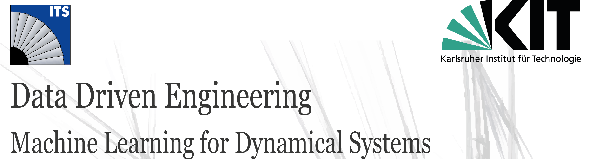
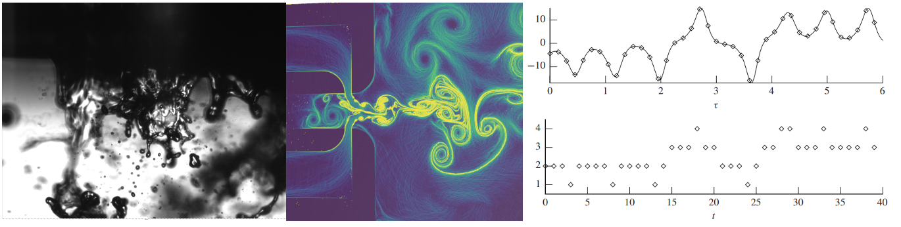

# Welcome to our new lecture series!

Engineering disciple stems from the ingenuity and the ability to contrive. This heritage has also been reflected on how the raw data is processed into information and distilled into engineering wisdom. Since its dawn, engineers have been dealing with massive amounts of data accumulated over decades of fundamental experiments and field measurements, vitalized in the form of cleverly organized charts, tables and heuristic laws. In the last few decades, our capability to generate data has increased even further with the developments in (i) the measurement techniques including the sensing technologies, (ii) computational power, (iii) faster, easier and cheaper data transfer and storage, (iv) post-processing tools and algorithms. In this regard, machine learning (ML) can be interpreted as a powerful tool that augments the traditional “wisdom distillation process” via automatic identification of the patterns hidden within the data.   

This lecture series focus on the fundamentals of intelligence and ML methodologies that can be utilized to solve engineering problems. In the first lecture, you will build up the basic skills needed to develop intelligent solutions for pattern recognition in experimental/numerical datasets, model abstractions, optimization and process control. Another objective is to establish a strong scientific background in order to clarify the current capabilities, challenges and opportunities in ML. The course includes weekly software sessions, organized as jupyter notebooks for hands-on experience and finalizes with an End-to-End Machine Learning Project. 

At the end of the lecture period, we are organizing best project contest, $`(KI)^2T`$, during which the finalists present their work. The best is decided by the votes of the audience! Feel free to explore these projects, which are available in the "Hall of Fame". 

In the second lecture, we dive into the details of the most recent applications in data driven engineering within the scope of machine learning (ML). Building upon the skills developed in the “Data Driven Engineering 1: Machine Learning for Dynamical Systems” course, you will learn about complex model architectures through different “themes”, with the objective of providing a deeper background and capability to navigate through the recent developments in the field.

The second lecture is also integrated with group projects. Here  groups of students are assigned open-ended research problems with scientific mentors from ITS at the beginning of the semester. In the following weeks, the groups work on their problems by combining the fundamental skills they gained in the first and second lectures. The progress will be monitored via project sessions throughout the semester. The finalized work will be presented at the end of the semester and published in the lecture repository.

## How does it work?

We have been using  Google's Colaboratory -- or Colab for short -- in the lecture. The necessary libraries are either readily available in Colab or installed in the respective Jupyter notebook (\*.ipynb).

> If you would like to test the code, just click the "Run in Colab" button!

## About the lecture notes and videos

Lecture videos are currently available only in ILIAS upon registration. The lecture notes are publically available in the repository. Use and/or modification of lecture slides outside of the DDE lecture series must reference:

> © ITS-KIT DDE: Data Driven Engineering Lecture Series
>
> http://www.its.kit.edu

## License
All the materials presented in this repository is copyright 2021 [Data Driven Engineering Lecture Series](https://www.its.kit.edu/Lehrveranstaltungen_DataDrivenEngineering_I.php). All Rights Reserved.

Licensed under the ITS-KIT License. You may not use this file except in compliance with the License. If you use the material presented in this repository and/or modified versions of the materials outside DDE lectures of ITS must reference:

> © ITS-KIT DDE: Data Driven Engineering Lecture Series
>
> http://www.its.kit.edu
